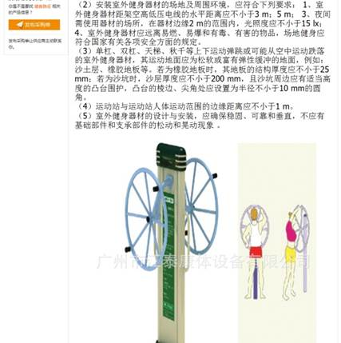
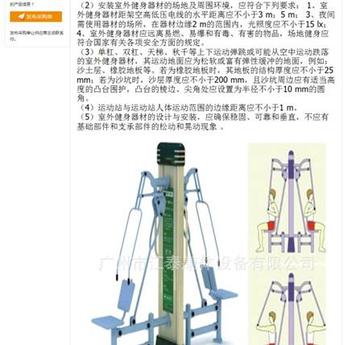
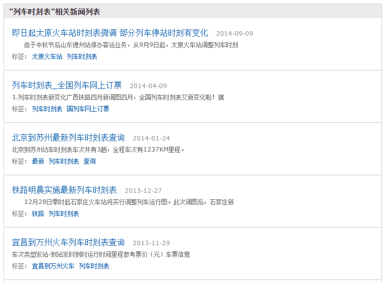
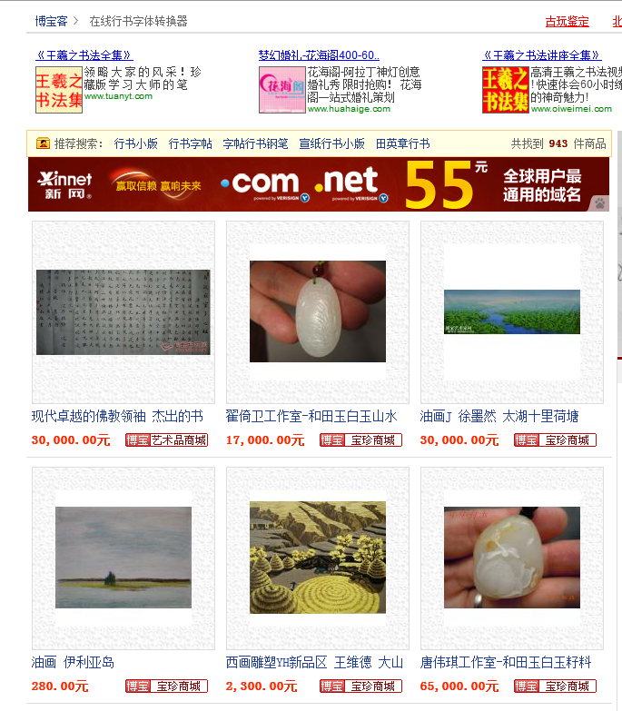
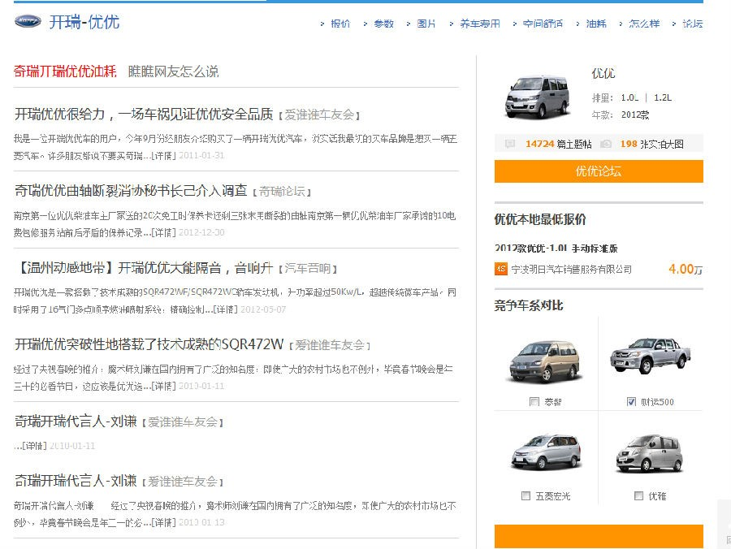
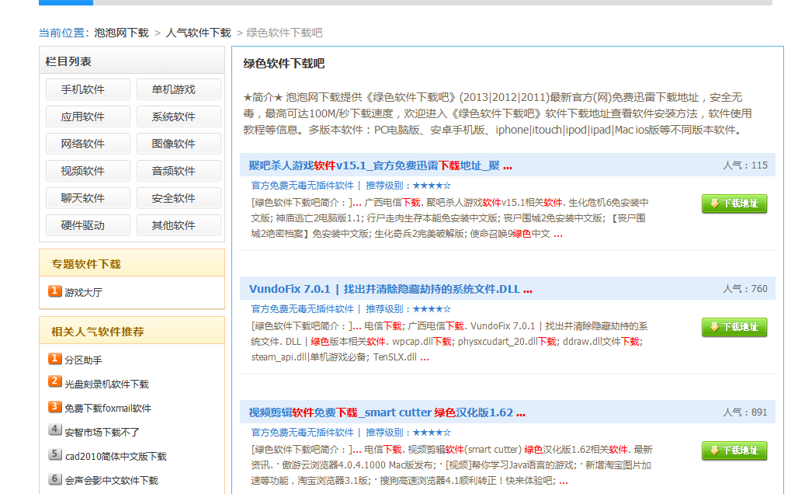

# 内容建设
## 选择网站关键词的方法
 ### 一 . 海选   
1. 圈定能高度概括你网站主题或所提供服务的一至三个关键词。如提供二手房产交易的网站可能圈定的关键词是：`二手房`；`北京二手房`；`房产中介` 等      
2. 找出你圈定的关键词的同义词：如网站的主题是 `旅游`，相应的同义词可能有 `旅行``自由行``自助游` 等，可以根据你网站可提供的服务和内容来确定 
3. 找出你网站主题或产品或服务所属领域的上一级类别关键词。并不是所有网站都可以找出上一级类别关键词，不必强求。（可以通过行业协会网站，观察他们在讨论类似内容时使用何种关键词）。如一些中小企业网站，生产插种机的小企业网站，上一级类别的关键词会是 `农业机械` 等
4. 列出网站内的所有产品词或品牌词或服务词
5. 找出用户在浏览你网站时的潜在需求及相关关键词。如境外旅游网站，用户在浏览的同时，很多情况下也是有外币汇率需求的
6. 尽可能地寻找与上述关键词有关的长尾关键词（如何寻找相关长尾关键词可见其它课程）
7. 考虑一下搜索引擎用户会通过怎样的关键词去查询你网站能提供的信息，即从潜在用户的搜索习惯上找到关键词

### 二 . 筛选
海选阶段会产生很多关键词，不可能全部在网站中得到体现，需要筛选出有 SEO 价值的部分。        
1. 确保关键词有搜索量，简单的说，就是确保关键词是真的有用户在搜索，且搜索量能达到一定水平。可以通过百度指数来解决这个问题。
2. 确保网站可以产出与关键词相关的内容，用户通过该关键词进入到你的网站后，会有诸如继续点击阅读、注册、下单等行为，即转化率——这一点搜索引擎是极为看重的
3. 考虑内容制作的难易程度是否在自己控制范围内，如上述所说的境多旅游用户的需求，外币汇率比较好解决，但还有诸多细节需求对于小型网站来说，满足起来难度较大。 

### 三 . 重要注意事项
1. 关键词所属领域应该与网站所属领域相关：如健康网站内可以有一些医学内容，而娱乐内容明显不合适。
2. 选择可以获得有效、安全的关键词：有些网站紧盯百度首页推荐的热词，再通过采集把大量内容填充进自己的网站，不仅对网站自身用户造成伤害，对提升转化率没有任何好处，也很容易被搜索引擎当垃圾内容进行惩罚。
3. 避免过度重视通用词：在海选中，我们确认网站内容主题服务主题的关键词，还要找上一级类别关键词，但这些关键词往往过于宽泛，建议网站还是抓住几个重点进行内容建设
4. 重视长尾关键词：在海选第 6 条我们提到应该寻找一些长尾关键词，但长尾关键词的检索量往往比通用词或非长尾要低许多，有些网站认为没有价值就放弃了。其实长尾关键词包含了用户更精准的信息，转化效果更好，SEO 竞争也更小，值得站长下一番工夫。

## 获得关键词数据的渠道有哪些
上面说到了站点收集关键词的方向，那么通过什么渠道可以获取关键词数据呢。关键词收集也可以叫关键词拓展，其实就是思路的拓展。这个思路在工作岗位中的表现不同：产品运营的角度，可能是个不断深挖行业用户需求、了解需求、站在用户角度想问题设计产品；而从搜索营销、seo 角度它则成为深挖行业用户需求的具体体现。那么获取关键词数据的主要渠道有哪些呢：    
1. 公开渠道：
    - 几家搜索引擎搜索结果相关搜索、SUG
    - 几家大的社交、媒体（微博）的相关搜索
    - 各搜索引擎的风云榜
    - 竞价关键词获取工具（搜索引擎一般都提供）
    - 百度司南工具
    - cnzz 数据中心（`http://data.cnzz.com/`）；

2. 通过站内工具：
    - Log 日志关键词数据；
    - 站内搜索关键词数据；
    - 商务通、商桥等在线咨询工具内的关键词；

3. 观察竞争对手：
    - 竞争对手网站上的 tag 页；
    - 竞争对手（尤其是对 seo 很重视的）站点 title；
    - 竞争对手竞价关键词；
    - 竞争对手页面 keyword；

4. 购买：
    - 寻找数据公司、工具服务商，购买数据

5. 常识拓展：
    - 问答类（百度知道、知乎）相关问题的提问挖掘
    - 内容评论中的需求挖掘，主题下的评论一定是跟这个主题紧密相关的关注点、bbs 评论
    - 通过了解行业用户组合关键词，如：地区 + 关键词

最后，就像大家知道的那样，即便这项工作真的很重要，但在如今碎片需求满足程度和信息内容大爆发的情况下，关注关键词背后的深层需求的分析、内容的差异提供、需求针对的产品细化，比不停的扩大关键词量要更重要的多。    

## 网站内容创作的大忌
网站制作内容是一件持续性投入的工作，在人力、技术、财力上都需要较大投入，一些站点急于求成寻找捷径，制作了很多垃圾内容，最终被搜索引擎惩罚，可谓得不偿失。希望站长抛弃以下行为，从《百度网页搜索质量白皮书》中寻找答案。       

1. 站内大量重复内容：很多网站，尤其是商业网站，往往使用同一个模板，不同网页的主体内容高度相似或相同，仅一些 TITLE 等标签进行了改变。比如一些招投标网站，为了让更多的地区得到投标内容，他们制作了大量页面，标题采用地区 + 内容的方式，而页面的主体内容都是完全相同的。再如下图，同样仅标题和图片不同，主体内容相对，对于百度搜索引擎来说，都属于站内大量重复内容。           
 
  

2. 利用与站点无关的热词引流：有些网站，尤其是新闻源站点紧盯百度的时效性热词，与自己网站文章的标题进行整合，其实就是我们常说的标题党，如 `李娜退役隐情　体育明星豪宅全揭秘`，用户点击后自然看不到关于李娜退役隐情的内容。此种行为一经发现，网站会被取消新闻源资格，即使内容真的是原创，也会因此行为遭受牵连。    

3. 制作低质静态搜索结果页或 TAG 标签页：很多网站都采用了将站内搜索结果页转为静态页面的方式，整合站点资源，以期形成相关性得分高的页面。但实际来看，很多站点通过站内搜索或者 tag 生成的页面相关性并不好，或者说产生了许多对百度搜索结果造成负面影响的页面。如果整个目录都存在这样的现象，那么被惩罚的可能性就非常大了。如下方截图，用户搜 `列车时刻表`，这样的页面对他来说毫无价值。该页面所在的目录或站点做了很多类似内容的页面，且已经对作用造成恶劣影响时，极容易受到搜索引擎的惩罚。    

4. 不负责任的采集：首先需要澄清的是，百度说的拒绝采集，指的是大量复制互联网上已有内容，对采集的内容不加整理即全部推至线上的 `偷懒` 行为。对于将采集来的内容进行再加工高效整合后，产出内容丰富的高质量网页，百度没有拒绝理由。所以，我们说，百度不喜欢不负责任的偷懒采集行为。    

5. 伪原创：上面我们说百度不喜欢不负责任的采集，于是有些人开始动起了伪装原创的脑筋。采集内容后对部分关键词进行批量修改，企图让百度认为这些都是独特内容，然而内容已经是面目全非，甚至无法读通——这也是百度不喜欢的，风险很大。还是刚才说的观点，百度不排斥站点采集内容，关键是如何应用采集的内容和数据，如何整合成用户和搜索引擎都需要的内容才是站长应该考虑的内容。     

## 不相关静态搜索结果页会受到严厉惩罚
部分网站遍历热门关键词、生成大量的站内搜索结果页来获取搜索引擎流量，其中存在大量不相关内容，严重损害了搜索引擎用户的搜索体验，并且侵占了相应领域的优质网站收益。百度质量团队明确表示：对于此类网站会做出严厉的处理。在上一篇《网站内容创作的大忌》中我们提到了 `制作低质静态搜索结果页或 TAG 标签页` 属于大忌，在此篇，我们把这个问题延展开来，提供更多的样例给各位参考。       

样例一：页面主题为 `在线行书字体转换器`，但该搜索结果页面中为各种商品列表，内容完全不相关。         

    

样例二：页面主题为 `奇瑞开瑞优优油耗`，但页面搜索结果中各种主题的内容都有，完全不相关。      
 
   

样例三：页面主题为 `绿色软件下载吧`，但搜索结果中的内容并非围绕该主题的软件下载，完全不相关。      
  
          
    
