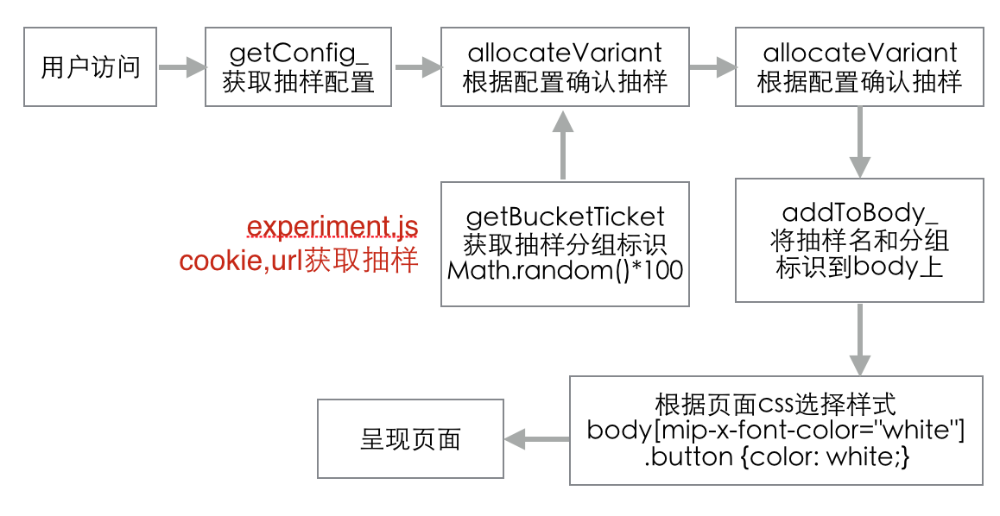

# Mip-experiment 设计文档
<ul>
    <li><a href="#intro">简介</a></li>
    <li><a href="#tech">技术方案</a></li>
    <li><a href="#tech-detail">技术细节</a></li>
    <li><a href="#example">站长使用</a></li>
    <li><a href="#future">站长使用</a></li>
</ul>

<div id="intro"></div>
## 简介
mip-experiment是一个用于页面实验的组件。站长通过配置实验变量，达到展示不同页面内容样式的目的。支持通过url配置，强制显示某个实验效果。

## 功能
1. 支持单个抽样的分组，支持配置单用户在实验期间体验是否统一（用户刷新是否会进不同的实验分组）
2. 支持配置多个抽样，且配置抽样间是否互相影响（实验一的A组和实验B的A组同时展现）
3. 支持url强制抽样

<div id="tech"></div>
## 技术方案


1. 前端抽样分组：用户第一次访问页面时，为用户分组，储存在cookie中。多次访问时，从cookie中查看用户分组。
2. 前端标记，修改样式：为标记分组，给body加上`mip-x-name="groupA"`属性。站长通过css选择器来控制前端样式。
3. 强制抽样：根据url中的hash获取强制抽样分组，跳过步骤1，直接标记分组。
4. 统计：支持百度统计或mip-pixel统计。

<div id="tech-detail"></div>
## 技术细节
#### 抽样分组：
从Cookie中读取实验分组。已存在分组的用户，直接标记分组。未存在分组的用户，使用math.random进行分组。

#### cookie:
使用mip-cookie组件，在cookie中储存用户的实验分组，支持多组实验同时进行。  
    
- 名称：mip-experiment
- 值：base64加密后的实验抽样标记
- 示例：bWlwLWV4cC1BPWdyb3VwQSZtaXAtZXhwLUI9Z3JvdXBFJm1pcC1leHAtMTIxMi0xMj15ZWxsb3c=
- 明文示例：mip-x-A=groupA&mip-x-B=groupE&mip-x-1212-12=yellow

#### url:
强制抽样，支持配置多组实验  

- 名称：实验名
- 值：分组名
- 示例：www.mip.com/a.html#mip-x-A=groupA&mip-x-12=yellow

#### 统计：

##### 一. 百度统计
使用百度统计的自定义变量api，将实验名和实验分组作为参数加入到统计请求中。具体需要和百度统计对一下技术方案。  

- _hmt.push(['_setCustomVar', 1, 'mip-x-A', 'groupA', 2]);
- 自定义变量参考：http://tongji.baidu.com/open/api/more?p=guide_setCustomVar

##### 二. mip-pix：使用mip-pix统计组件发请求
站长在使用mip-pix组件时加入mip-x-A={mip-x-A-group}参数，在组件中会将mip-x-A-group替换成mip-x-A的分组，拼出最终请求。

```
// mip-pix 用法
<mip-pix src="https://yourselfdomain/mipurl/tj.gif?
    t={TIME}&title={TITLE}&host={HOST}
    &mip-x-A={MIP-X-A}&mip-x-B={MIP-X-B}
    &from=baidu">
</mip-pix>

// 产生的mip-pix请求
https://yourselfdomain/mipurl/tj.gif?
    TIME=1483961727115&
    title=%E…%97%E6%AC%A2%E8%BF%8E&
    host=http%3A%2F%2F172.20.130.52%3A8014%2Ffixed1.html&
    from=baidu&
    mip-x-A=groupRed&
    mip-x-B=groupYellow
```

### 广告统计计费（重要！）
<span style="color:red">现有广告计费方式为：页面加载后算一次广告展示。页面广告在隐藏元素中或用户未看到广告也算一次展示。</span>


<div id="example"></div>
## 站长使用
例如，站长需要针对广告位A进行抽样，40%显示广告M，40%显示广告N,20%不显示广告。

### 抽样配置
```
<mip-experiment>
    <script type="application/json">
    {
        "ad-A-exp": {
            "variants": {
                "showM": 40,
                "showN": 40
            }
        }
    }
    </script>
</mip-experiment>
```
### css代码
```
/* 40%流量显示广告M */
body[amp-x-ad-A-exp="showM"] .wrapper-A .M {
    display: block;
}
body[amp-x-ad-A-exp="showM"] .wrapper-A .N {
    display: none;
}

/* 40%流量显示广告N */
body[amp-x-ad-A-exp="showN"] .wrapper-A .M {
    display: none;
}
body[amp-x-ad-A-exp="showN"] .wrapper-A .N {
    display: block;
}

/* 20%流量不显示广告 */
body .wrapper-A .M,
body .wrapper-A .N {
    display: none;
}
```
<div id="future"></div>
## 未来计划
1. 修改mip-pix代码，支持统计
2. 与百度统计合作，支持统计
3. 广告统计计费方案确认
3. cookie中确认是否可以增加`mip-experiment=bWlwLWV4cC1BPWdyb3VwQSZtaXAtZXhwLUI9`
4. 编写用户分组，url抽样，cookie抽样逻辑
5. 支持实验分组，AB两个实验分组具有相关性